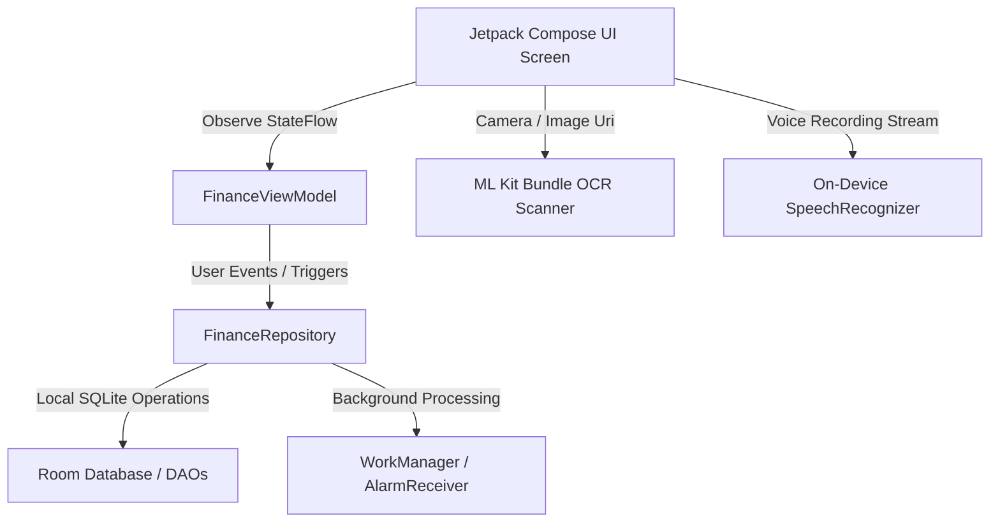

# 🇳🇵 Kharcha — Premium Local-First Personal Finance Tracker

<div align="center">
  
  <h3>A local-first, privacy-respecting personal finance manager, smart budget planner, and localized savings tracker designed specifically for Nepal.</h3>

  [](https://developer.android.com)
  [](https://kotlinlang.org)
  [](https://developer.android.com/jetpack/compose)
  [](LICENSE)
</div>

---

**Kharcha** (meaning *expense* in Nepali) is a feature-rich, high-performance Android application built with Jetpack Compose, clean architectural patterns (MVVM), and a localized first-class design system. Designed from the ground up for Nepal, it operates **100% offline** using bundled on-device machine learning (ML Kit Text-Recognition) and speech processing to ensure absolute privacy for your personal ledger—with zero cloud syncing, zero accounts, and zero tracking.

---

## ✨ Features at a Glance

### 🔍 1. Offline OCR Receipt Scanner
*   **On-Device Machine Learning:** Leverages Google's bundled ML Kit Text Recognition to process cash receipts, restaurant bills, and merchant invoices instantly, without an internet connection.
*   **Automatic Extraction:** Smartly parses merchant name, dates, payment methods, transaction reference codes, and total amounts.
*   **Expandable Metadata Display:** Interactive transaction history cards expand with rich slide animations to reveal extracted OCR tags, raw receipt metadata, and verification details.

### 🎙️ 2. Voice-to-Transaction Input
*   **Hands-Free Logging:** Speak naturally to log your financial events.
*   **On-Device Speech Engine:** Utilizes the local SpeechRecognizer API to parse spoken audio on the fly.
*   **Smart Semantic Extraction:** Auto-extracts amounts and notes (e.g., *"Spent 500 rupees on lunch with friends"*) to populate the transaction form instantly.

### 🇳🇵 3. Nepal Fiscal Year (FY) Mode
*   **True Regional Financial Bounds:** Align your entire financial dashboard and reports to the authentic Nepal Fiscal Year (`Shrawan 1st` to `Ashad 30th/31st` — approximately July 16 to July 15 next year).
*   **Dynamic Bikram Sambat (BS) Period Headers:** Automatically calculates and displays the current Bikram Sambat fiscal period (e.g., `"FY 2082/83 BS"`).
*   **Global Layout Transition:** Flipping the Nepal FY Mode toggle in Settings instantly re-calculates all Dashboard totals (`Income`, `Expense`, `Net Balance`) and shifts all history and report views into the FY calendar boundary, disabling month-picker chevrons automatically.

### 📅 4. Cash Flow Calendar
*   **Interactive Monthly Grid:** An elegant calendar interface calculating daily cash flow totals (`Income - Expenses`).
*   **Color-Coded Status Indicator:**
    *   🟢 **Mint Green (`+`)** indicates a net positive cash flow day.
    *   🔴 **Soft Red (`-`)** indicates a net negative spending day.
    *   ⚪ **Muted Grey** denotes neutral, matching, or inactive days.
*   **Daily Flow Breakdown:** Tapping any active grid cell slides open a detailed, animated transaction card showing the complete list of cash movements for that specific day.

### 📊 5. Deep Analytics & Smart Insights
*   **Advanced Data Visualizations:**
    *   **Spending Trend Charts:** High-fidelity 6-month line charts tracking overall expense trajectories.
    *   **Categorical Donut Charts:** An interactive, smooth-animating breakdown of category distributions.
    *   **Month-over-Month (MoM) Comparisons:** Side-by-side transaction metrics comparing current vs. previous periods with dynamic `↑ Red` or `↓ Green` percentage-change badges.
*   **Rule-Based Offline Insights Engine:** Fully on-device rule interpreter pointing out critical changes like category overspend alerts (>20% MoM increase), saving/budget streaks, and biggest expense outliers.
*   **50/30/20 Budgeting Rule Calculator:** A dedicated framework mapping actual expenses against ideal splits (Needs, Wants, Savings) to ensure long-term financial health.
*   **Spending Mood Tracker:** Tag expenses with emoji-based emotional triggers (`Necessary`, `Happy`, `Regret`, `Impulse`). Generates detailed emotional spending audits, showing your **Regret Spending Percentage** to guide better habits.

### 🏔️ 6. Smart Debt Payoff Planner
*   **Comprehensive Debt Tracker:** Map out all outstanding liabilities, interest rates, and minimal due payments.
*   **Avalanche vs. Snowball Simulator:** Compare real-time payoff timelines under two of the most popular strategies:
    *   **Debt Avalanche:** Targets the highest interest rates first, minimizing total lifetime interest paid.
    *   **Debt Snowball:** Targets the lowest principal balances first, yielding quick emotional wins.
*   **Clear Savings Output:** Dynamically calculates exact payoff dates and total interest saved per strategy.

### 🎯 7. Budgets & Envelopes
*   **Multi-Category Budget Thresholds:** Set monthly limit alerts for specific sectors (Food, Utilities, Travel, etc.) with progressive warning indicators.
*   **Envelope Budgeting Mode:** Go "Zero-Based" by allocating income into custom financial envelopes at the start of the month, alerting you before any overspend occurs.

### 🔒 8. Military-Grade Privacy & Security
*   **100% On-Device Room Database:** All account sheets, receipts, net-worth structures, assets, and configurations remain secured on your physical device.
*   **Secure Window Flags:** Implements Android's `FLAG_SECURE` layout flag globally. This locks down window drawing, rendering screenshots, screen recordings, and secondary video mirrors completely blank to prevent accidental financial leaks.
*   **Biometric Authentication:** Integrates native BiometricPrompt API (Fingerprint / Face Unlock) to secure access on startup.

---

## 🛠️ Architecture & Tech Stack

Kharcha is designed around Modern Android Development (MAD) practices, enforcing strict separation of concerns, testability, and fluid animation cycles.



*   **Jetpack Compose:** Declarative, modern UI with Custom Theme tokens (`PaleSurface`, `TealPrimary`, `DarkSurfaceElevated`), responsive layouts, and standard dark theme assets.
*   **Kotlin Coroutines & Flow:** Completely asynchronous data streaming from the DB through the view layers.
*   **Room DB Migration:** Single robust migration architecture (`MIGRATION_3_4`) mapping multiple new tables (`assets`, `liabilities`, `debts`, `envelopes`, `templates`) and column expansions seamlessly.
*   **WorkManager & Alarms:** Coordinates daily push notification alerts, recurring transaction processing (`RecurringWorker`), and the 24-hour spending summary digest (scheduled at 22:00 daily).

---

## 🚀 Getting Started

### Prerequisites
*   **Android Studio** Hedgehog (2023.1.1) or newer.
*   **JDK 17** (Ensure your Android Studio Gradle settings point to JDK 17).
*   **Device SDK:** Android 7.0 (API Level 24) or newer.

### Build and Run locally
1.  **Clone the project repository:**
    ```bash
    git clone https://github.com/Siz09/finance-tracker.git
    cd finance-tracker
    ```
2.  **Open in Android Studio:**
    *   Select **File** → **Open...** and pick the `finance-tracker` directory.
    *   Allow Gradle to download and sync all dependencies.
3.  **Compile & Verify from Terminal:**
    To verify that all Kotlin classes, Compose components, and database schemas compile cleanly:
    ```powershell
    $env:JAVA_HOME="C:\Program Files\Android\Android Studio\jbr"
    ./gradlew compileDebugKotlin
    ```
4.  **Run:**
    Deploy to a local emulator or a connected physical Android device using the play icon in Android Studio.

---

## 📂 Project Organization

```text
app/src/main/java/com/example/
│
├── FinanceApplication.kt             # Application class initializing notifications/workers
├── MainActivity.kt                  # Activity entry-point managing secure flags, theme, and NavGraph
│
├── data/                            # Core Data Layer
│   ├── model/                       # Data structures (Transaction, Budget, Debt, Envelope, etc.)
│   ├── dao/                         # Room Data Access Objects (FinanceDao)
│   └── repository/                  # Main Repository orchestration (FinanceRepository)
│
├── ui/                              # Screen View Layer
│   ├── theme/                       # Design system tokens, color palettes, and typography
│   ├── navigation/                  # Navigation Compose structure and fluid slide configurations
│   ├── viewmodel/                   # StateFlow exposure and rule engines (FinanceViewModel)
│   └── screens/                     # Jetpack Compose UI Screens
│       ├── DashboardScreen.kt       # Dashboard cards, Nepal FY switch, progress meters
│       ├── TransactionsScreen.kt    # Scrollable transaction lists with filter chips
│       ├── TransactionFormScreen.kt # Receipt scanner, Voice recorder, Mood emoji, Templates
│       ├── ReportsScreen.kt         # MoM comparison, Line charts, 50/30/20 split, Insights
│       ├── CalendarScreen.kt        # Monthly grid mapping daily net flows
│       └── settings/                # Sub-configurations (Debt, Savings, Backups, Budgets)
│
└── utils/                           # Core utilities (OCR Helper, ExportHelper, Biometrics)
```

---

## 🔒 License
This project is licensed under the MIT License - see the [LICENSE](LICENSE) file for details.
